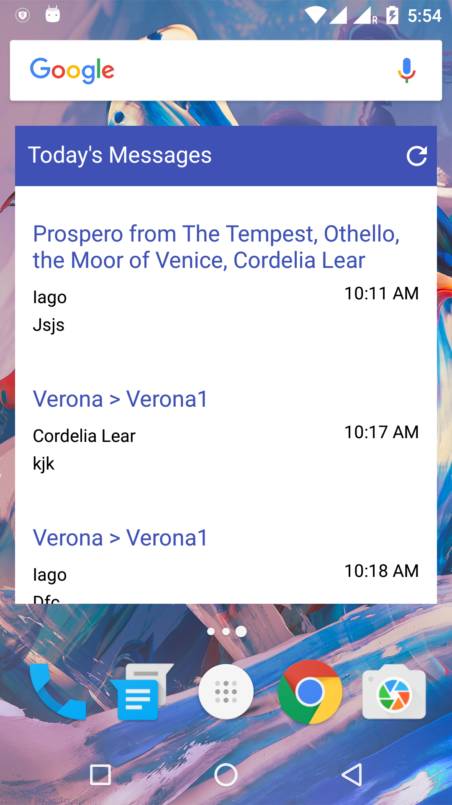
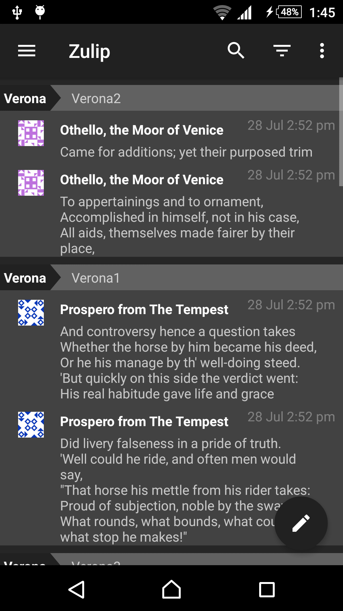
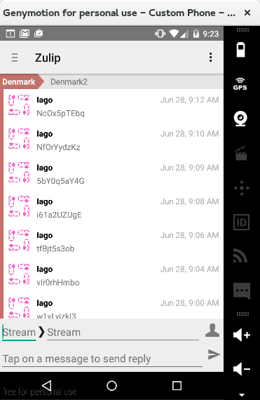

Brief report of my work in GSOC 2016

<!--more-->

In this course of GSOC I did many changes in the [Zulip-Android Project](https://github.com/zulip/zulip-android)

*   Changed the UI of the app
*   Changed the login flow of the app, now this shows all the possible backends for any server.
*   Changed the network connectivity libraries to a much faster, better, efficient library
*   Implemented a widget for the homescreen to read messages, _Currently unmerged, but under review process_
*   Implemented a chatBox to easily send messages
*   Implemented a multi login system to allow zulip app to be logged in two or more accounts simultaneously _Currently unmerged, but under review process_
*   Implemented suggestions for emoticons as we type in the message Box
*   Implemented to show the number of unread messages counts _Currently unmerged, but under review process_
*   Fixed a bug which was sometimes flooding the server
*   Implemented a Authentication system (DevAuthBackend) which was previously supported only by the web App
*   + Much more

You can see the full commit list [here](https://github.com/zulip/zulip-android/commits?author=kunall17)

A total of 6,937 ++ line additions and 3,137 line deletions by my commits!

And here is the list of all the features/Pull Request's, they can also be [viewed in github](https://github.com/zulip/zulip-android/pulls?utf8=%E2%9C%93&q=is%3Apr%20author%3Akunall17%20)

[Updated Readme](https://github.com/zulip/zulip-android/pull/152)

[Create JavaDocs for classes and methods](https://github.com/zulip/zulip-android/pull/144)

[Implemented swipe to remove chatBox](https://github.com/zulip/zulip-android/pull/143)

[Fixes #131: Wrong messages order](https://github.com/zulip/zulip-android/pull/142)

[Espresso Test](https://github.com/zulip/zulip-android/pull/141)

[Fixes: #132 Show Title and name in header if narrowed to self PM's](https://github.com/zulip/zulip-android/pull/140)

[Fixes: #136 Narrow by stream on click](https://github.com/zulip/zulip-android/pull/139)

[Implemented a Widget for reading messages](https://github.com/zulip/zulip-android/pull/129)

[Fix: multiple asyncGetEvents](https://github.com/zulip/zulip-android/pull/128)

[Fix on narrow to private message](https://github.com/zulip/zulip-android/pull/125)

[Show unread counts in the stream drawer](https://github.com/zulip/zulip-android/pull/120)

[Create blank drawable if no emoji present](https://github.com/zulip/zulip-android/pull/119)

[Do not open keyboard on narrowing](https://github.com/zulip/zulip-android/pull/118)

[Fixes: Clear topic expansion in streams drawer when unnarrowing/renarrowing](https://github.com/zulip/zulip-android/pull/117)

[Fixed: Custom zulip server defaults to http](https://github.com/zulip/zulip-android/pull/116)

[Fixed Many lint bugs](https://github.com/zulip/zulip-android/pull/115)

[Save Client ID for registering GCM to that client](https://github.com/zulip/zulip-android/pull/114)

[Add User-Agent header to HTTPRequest](https://github.com/zulip/zulip-android/pull/113)

[Switch DayNight theme (Light <---> Dark Theme)](https://github.com/zulip/zulip-android/pull/110)

[Make it easy to compose messages with mentions, emoji, etc.](https://github.com/zulip/zulip-android/pull/108)

[Show Error Message if no messages present in current list](https://github.com/zulip/zulip-android/pull/102)

[Better Login Flow](https://github.com/zulip/zulip-android/pull/101)

[Added Clickable Links to narrow for user!](https://github.com/zulip/zulip-android/pull/100)

[Removed Use zulip.com checkbox](https://github.com/zulip/zulip-android/pull/99)

[Fixup: error handling of bad event queue id](https://github.com/zulip/zulip-android/pull/98)

[Hide soft keyboard when LoginActivity starts](https://github.com/zulip/zulip-android/pull/97)

[Implemented Expandable ListView in the streamsDrawer](https://github.com/zulip/zulip-android/pull/85)

[Added Loading dialog for devAuth](https://github.com/zulip/zulip-android/pull/84)

[AppCompatActivity and Toolbar AppCompatChanges](https://github.com/zulip/zulip-android/pull/83)

[Implemented RecyclerView inplace of ListView + UI updated](https://github.com/zulip/zulip-android/pull/81)

[Fix the previous chatBox espresso test's](https://github.com/zulip/zulip-android/pull/79)

[Allow non-Zulip.com installs to login via Google Auth](https://github.com/zulip/zulip-android/pull/70)

[Replaced Old Apache HTTP Libraries with OkHttpClient](https://github.com/zulip/zulip-android/pull/69)

[Developed Login for DevAuthBackEnd #48](https://github.com/zulip/zulip-android/pull/65)

[Switch/Add servers without logging in/out](https://github.com/zulip/zulip-android/pull/51)

[Implemented chatBox to directly reply.](https://github.com/zulip/zulip-android/pull/45)

[Implement Mute topics](https://github.com/zulip/zulip-android/pull/42)

[Added Codestyle instructions to the Readme](https://github.com/zulip/zulip-android/pull/41)

[Added Material design](https://github.com/zulip/zulip-android/pull/27)

[Migrated To Gradle](https://github.com/zulip/zulip-android/pull/25)

And in the [Zulip Server project](https://github.com/zulip/zulip) I did some small code changes in these Pull Request's-

[Login API's for DevAuthBackEnd for Android project](https://github.com/zulip/zulip/pull/851)

[Fixed Correct version in commands](https://github.com/zulip/zulip/pull/577)

## Some screenshots of the features which I loved to built the most.

## Widget

**Implemented a widget for easy messages view.**

_Currently unmerged, hopefully will be merged soon!_

## White/Dark Theme

**This allowed switching between dark/light theme.**

## RecyclerView

**A new layout for the list containing the messages.**

